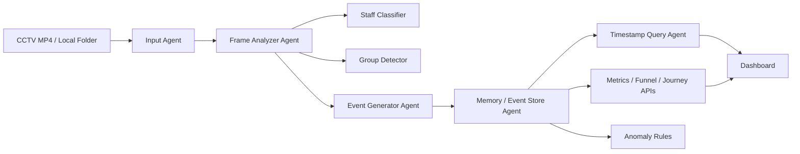

# Agentic Store Intelligence Design

## Architecture

## Agent Responsibilities

- **Input Agent**: validates MP4/local files, extracts video metadata, FPS, duration, timestamp offset, and one-second chunks.
- **Frame Analyzer Agent**: samples video second-by-second, detects people with YOLO when enabled or OpenCV fallback, tracks ids, zones, staff role hints, groups, and per-second dwell.
- **Staff Classifier**: explainable heuristic using restricted zones and track persistence; all people are emitted as either `customer` or `staff`.
- **Group Detector**: assigns `group_id` when visitors are close enough in the same timestamp.
- **Event Generator Agent**: emits structured events with `event_id`, `timestamp`, `video_time_sec`, `frame_id`, `visitor_id`, `track_id`, `group_id`, `role`, `event_type`, `zone`, `confidence`, and `metadata`.
- **Memory / Event Store Agent**: stores events, sessions, tracks, dwell, POS, processed videos, and anomalies in SQLite.
- **Metrics Agent**: computes session-based metrics, funnel, zones, visitor timelines, and anomaly lists.

## Data Flow

1. Video is uploaded or demo video is generated.
2. Input metadata is extracted and passed to the analyzer.
3. Analyzer emits observations per second.
4. Event generator converts observations into schema-compliant events.
5. Store agent deduplicates events, updates visitor sessions, maps track ids to stable visitor ids, updates dwell/group/reentry state, and creates anomaly records.
6. APIs and dashboard query session-based analytics.

## APIs

- `GET /health`
- `POST /events/ingest`
- `POST /videos/upload`
- `POST /videos/local`
- `POST /demo/run`
- `GET /metrics?store_id=...`
- `GET /funnel?store_id=...`
- `GET /zones?store_id=...`
- `GET /anomalies?store_id=...`
- `GET /visitor/{visitor_id}/timeline?store_id=...`
- Existing store-scoped dashboard APIs remain available under `/stores/{store_id}/...`.

Anomaly responses include `proof` objects with timestamp, rule, measured value, threshold, unit, visitor id, zone, and video/frame references when available.
